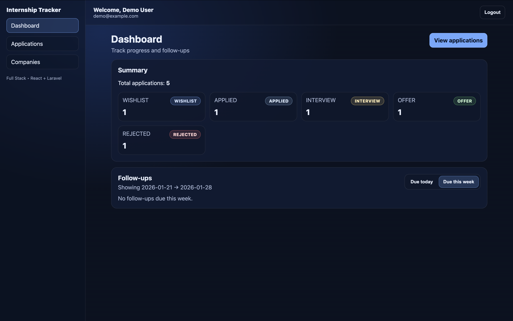
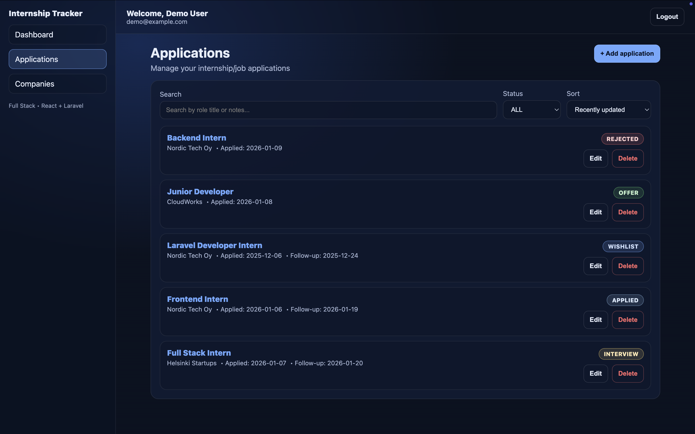
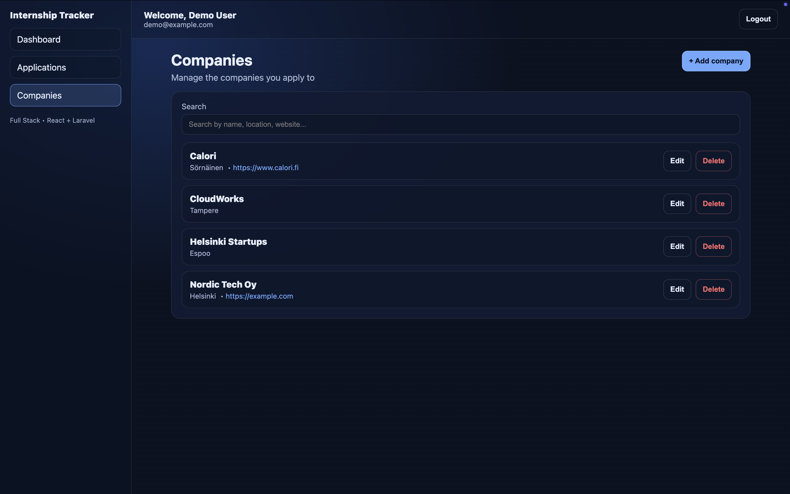
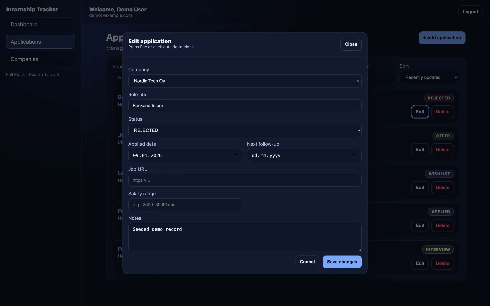
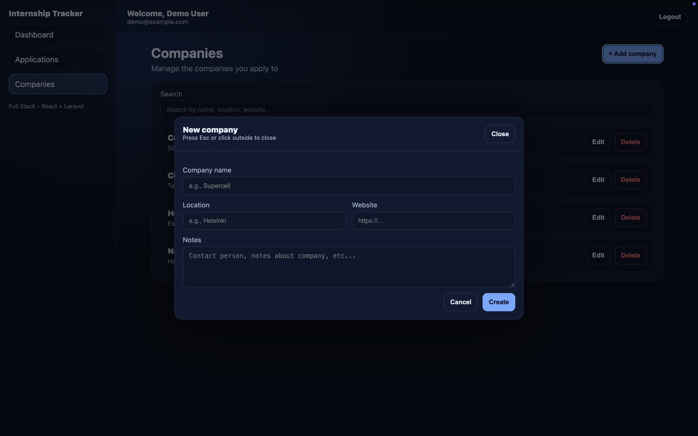
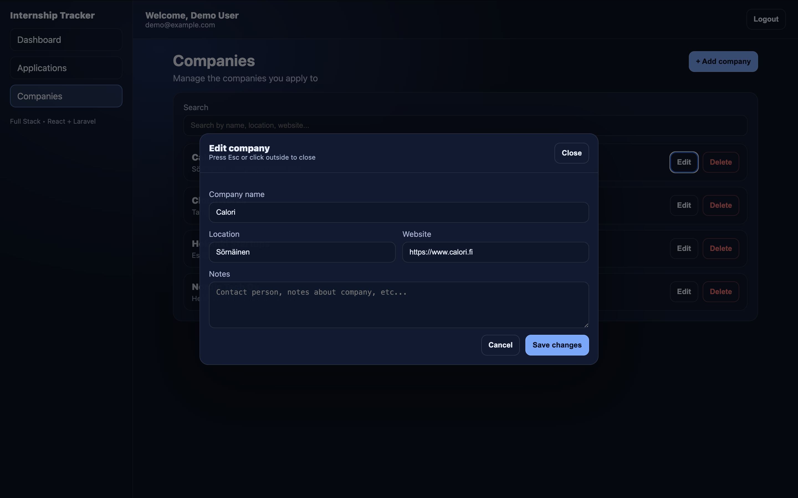

# Internship Tracker

A full‑stack **Internship / Job Application Tracker** built with **React + Laravel**.  
Track applications, companies, statuses, follow‑ups, and manage everything in a clean **dark & light mode UI**.

---

## ✨ Features

- 🔐 Authentication (Login / Register)
- 📊 Dashboard with application summary
- ⏰ Follow‑ups tracking (today / this week)
- 🗂 Applications CRUD with filters & sorting
- 🏢 Companies CRUD
- 🧾 Application timeline & notes
- ⚡ Modern UI (React + CSS variables)
- 🔒 Secure API with Laravel Sanctum

---

## 🖼 Screenshots

### Dashboard



### Applications


### Companies


### Edit Application


### Add New Company


### Edit Company



---

## 🛠 Tech Stack

**Frontend**
- React
- React Router
- Context API
- CSS Variables (Theme system)

**Backend**
- Laravel
- Sanctum Authentication
- REST API

**Database**
- MySQL / SQLite

---

## 🚀 Installation

### Backend
```bash
cd backend
composer install
cp .env.example .env
php artisan key:generate
php artisan migrate --seed
php artisan serve
```

### Frontend
```bash
cd frontend
npm install
npm run dev
```

---

## 🔑 Demo Credentials

```
Email: demo@example.com
Password: password
```

---

## 📌 Roadmap

- 📈 Analytics & charts
- 🔔 Email reminders
- 📄 Export applications (CSV / PDF)
- 📱 Mobile‑friendly improvements

---

## 📄 License

MIT License

---

**Built with ❤️ using React & Laravel**